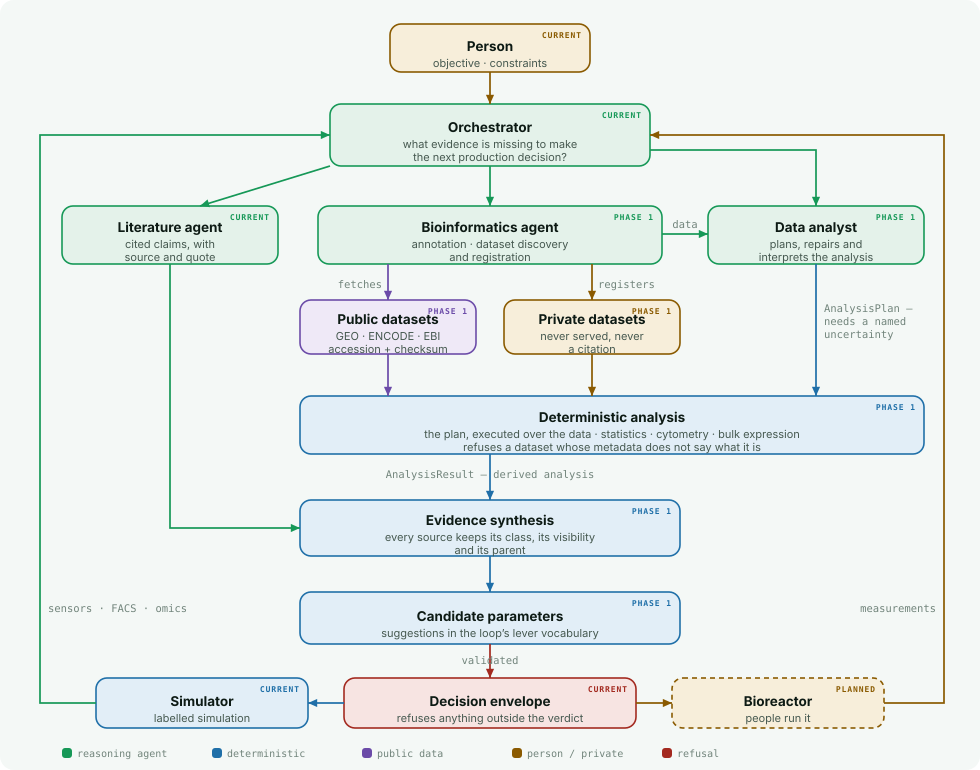

<div align="center">


### Accelerating cell-based therapy with agentic orchestration and real time evidence detection.
### Define your purpose. Watch agents work it. Read why every choice was made.

<a href="docs/RUN_ON_YOUR_PC.md"><b>Run it on your PC</b></a> ·
<a href="docs/IPSC_TCELL_EXAMPLE.md"><b>Worked example</b></a> ·
<a href="reports/"><b>Example reports</b></a> ·
<a href="docs/BIOINFORMATICS.md"><b>Data &amp; evidence</b></a> ·
<a href="deploy/README.md"><b>Hosting</b></a>

</div>

---

## The problem, and what BioSense does about it

BioSense is designed to accelerate the development of cell-based therapies by
tackling one of the biggest bottlenecks in the field: biological manufacturing
and experimental optimisation are complex, slow, and still heavily dependent on
fragmented data, manual interpretation, and repeated trial-and-error. Instead of
forcing scientists to navigate literature, datasets, experimental variables, and
process measurements separately, BioSense turns a high-level biological objective
into an iterative **design → run → measure → decide** workflow.

An agentic orchestration layer coordinates specialised AI agents for literature
evidence, bioinformatics, data analysis, simulation, and experimental planning,
continuously combining prior knowledge with new results. During execution,
feedback from the bioreactor and multiple sensors, detectors, and analytical
measurements provides real-time information on how the cell product is
responding, allowing the system to refine conditions and propose the next
experiment. Scientists interact through a simple interface — asking a question,
defining the desired outcome, and reviewing transparent assumptions and
reasoning — while BioSense manages the complexity underneath.

The long-term goal is a closed-loop discovery and manufacturing system that
learns from every experiment, reduces unnecessary iterations, and helps move
safer, more effective cell therapies toward patients faster.

> **Where the repository stands against that.** The five specialist agents exist,
> the measurement-driven analysis is implemented, and the bioinformatics agent
> now plans and executes real analyses over public and private datasets rather
> than only reading gene annotations. Three parts of the goal are not reached:
> the loop runs against a **synthetic stand-in, not a real bioreactor**; **live
> model-driven orchestration has not been run yet**; and each loop starts fresh,
> so **nothing is learned across runs**. Everything below describes what
> runs today, and [What this is **not**](#what-this-is-not) sets out the limits
> in full.

---

## How it works

Language models are good at reading and reasoning. They are **not** good at being
trusted with the arithmetic, the pass/fail calls, or the authority to spend a week
of someone's cells. So those jobs are split apart:

**The agent chooses. Separate, deterministic code decides what it is allowed to
choose — and refuses the rest.**

<picture>
  <source media="(prefers-color-scheme: dark)" srcset="docs/assets/arch-system-dark.svg">
  
</picture>

Everything a model writes is a **proposal**. Everything that counts as a fact —
the verdict, the QC calls, the metrics, the comparison between arms, every
statistic — is computed. If the agent proposes something the verdict does not
permit, the envelope refuses it and says why.

| The model does | The code does |
|---|---|
| Reads papers, extracts cited claims | Computes every metric and verdict |
| Decides *what evidence is missing* | Refuses an analysis that names no uncertainty |
| Designs an analysis | Executes it deterministically, and does the statistics |
| Forms a hypothesis about why a run failed | Decides which actions the verdict permits |
| Chooses one action and explains it | Refuses anything outside that set |
| Writes the brief for the next protocol | Enforces that only a revision costs an iteration |

### The loop it runs

<picture>
  <source media="(prefers-color-scheme: dark)" srcset="docs/assets/arch-loop-dark.svg">
  
</picture>

An analysis never changes a parameter. It produces evidence; the orchestrator
decides, and the envelope can refuse.

---

## Try it in three commands

Install [uv](https://docs.astral.sh/uv/) (it fetches Python for you), then:

```bash
git clone https://github.com/AbhinavSoni20191995/Biosense.git
cd Biosense && uv sync --locked
uv run --frozen python -m biosense.production.app --runs runs --static webapp
```

Open **<http://127.0.0.1:8000>** and type a question.

> No API key. No internet after install. Nothing calls a model. A full
> 25-iteration run finishes in about **1.5 seconds**.

<picture>
  <source media="(prefers-color-scheme: dark)" srcset="docs/assets/console-dark.png">
  
</picture>

While it runs, the agents announce what they are doing:

<picture>
  <source media="(prefers-color-scheme: dark)" srcset="docs/assets/agents-dark.png">
  
</picture>

Full setup, including Windows → **[docs/RUN_ON_YOUR_PC.md](docs/RUN_ON_YOUR_PC.md)**

---

## A worked result

Two questions, one run each:

1. *Optimise wild-type T cells grown from iPSC.*
2. *Now do it with a **BACH2 knockout** that must reach the same target.*

<picture>
  <source media="(prefers-color-scheme: dark)" srcset="docs/assets/trajectory-dark.png">
  
</picture>

| | Arms | Iterations used | Outcome |
|---|---|---|---|
| Wild type alone | WT | **3** of 30 | 25.7 — target met |
| With the knockout | WT + BACH2 KO | **25** of 30 | 25.7 and 26.0 — both met |

The number to look at is **3 against 25**. Adding one knocked-out arm multiplied
the search eightfold, and the loop says why in its own words:

> IL-7 cannot be set to one shared value: moving it 16 → 25.6 ng/mL improved
> BACH2_KO and degraded WT. The arms are being given separate values of this
> parameter from here on.

That is the finding: **no single shared recipe could serve both genotypes.** The
search established it from measurements rather than assuming it, then split the
parameter per arm. The knockout ended up needing more IL-7 at every stage and a
weaker TCR stimulus.

Reports, committed and readable without running anything →
**[`reports/`](reports/)** · the full write-up, including everything this does
*not* show → **[docs/IPSC_TCELL_EXAMPLE.md](docs/IPSC_TCELL_EXAMPLE.md)**

---

## It reasons across evidence, not just papers

BioSense weighs published literature, public datasets, a person's own
unpublished data, simulation and real measurements — and keeps them apart.

<picture>
  <source media="(prefers-color-scheme: dark)" srcset="docs/assets/arch-evidence-dark.svg">
  
</picture>

Three facts stay separate, because collapsing them is how provenance gets lost.
An analysis of somebody's own FACS run is:

```
evidence_class        : derived_analysis      ← what it IS
source_evidence_class : private_user_dataset  ← what it came FROM
source_visibility     : private               ← who may SEE it
```

<picture>
  <source media="(prefers-color-scheme: dark)" srcset="docs/assets/analysis-card-dark.png">
  
</picture>

**No analysis may run without naming the uncertainty it would reduce.** Not as a
convention — `AnalysisPlan` requires `uncertainty_ref`, and a plan citing a
hypothesis the loop never raised is refused by name. That is the difference
between a bioinformatics capability and a dashboard.

What runs today, and what is only declared:

<picture>
  <source media="(prefers-color-scheme: dark)" srcset="docs/assets/arch-capabilities-dark.svg">
  
</picture>

Your own data stays yours: it lives outside every served directory, is
git-ignored, is never listed by the web app, and **can never become a literature
citation** — a claim needs a source, a paragraph and a verbatim quote, and a
measurement has none of those. It can support a hypothesis, contradict public
evidence and suggest a parameter. It cannot be cited.

Full detail → **[docs/BIOINFORMATICS.md](docs/BIOINFORMATICS.md)**

---

<!-- BENCHMARK:START -->

## A worked demonstration

> **SYNTHETIC DEMONSTRATION.** Every input is an invented fixture committed to this
> repository and the simulator is a mechanistic stand-in. No number below is a
> measurement of any real cell.

**Is M-CSF limiting monocyte output?** — project `ipsc_macrophage` v1.0.0, run offline with no model API and no network.

```bash
uv run --frozen python -m biosense.benchmark.cli run \
  --config benchmarks/configs/macrophage_mcsf_demo.json
```

<picture>
  <source media="(prefers-color-scheme: dark)" srcset="benchmarks/public/macrophage_mcsf_demo/figures/workflow-dark.svg">
  
</picture>

BioSense started from the objective *"Increase viable macrophage production while maintaining macrophage identity and viability."*, identified the unresolved question `GAP-mcsf-dose`, and planned an analysis against it.

It ran `cytometry.population_comparison` v1.0.0 over `facs-mcsf-fixture`:

- CD14_pos_pct: 41.18 in control vs 67.58 in mcsf_high (+26.4) — *Welch's t-test, p=0.00132, BH-q=0.00176, n=3 vs 3, 95% CI [21.5, 31.5]*
- CD206_pos_pct: 33.5 in control vs 57.52 in mcsf_high (+24.02) — *Welch's t-test, p=0.000335, BH-q=0.000671, n=3 vs 3, 95% CI [21.4, 26.7]*

### The hypothesis it formed

Changing M-CSF may improve the objective: Increase viable macrophage production while maintaining macrophage identity and viability.

| Outcome | Baseline → Candidate | Change | Provenance |
|---|---|---|---|
| CD14 pos pct | 41.18% → 67.58% | +26.4 pp (+64.1%) | DERIVED |
| CD16 pos pct | 16.93% → 31% | +14.06 pp (+83.04%) | DERIVED |
| viability pct | 93.96% → 91.04% | -2.922 pp (-3.11%) | DERIVED |
| CD206 pos pct | 33.5% → 57.52% | +24.02 pp (+71.69%) | DERIVED |
| Monocytes per input iPSC | 17.99 cells/input_cell → 29.66 cells/input_cell | +11.67 cells/input_cell (+64.87%) | SIMULATED |
| Harvested cells | 8.995 1e6 cells/mL → 14.83 1e6 cells/mL | +5.835 1e6 cells/mL (+64.87%) | SIMULATED |
| Final viability | 80.78% → 80.78% | +0 pp (+0%) | SIMULATED |
| Cells in the monocyte gate | 76.66% → 90.25% | +13.59 pp (+17.73%) | SIMULATED |
| Peak viable cell density | 4.762 1e6 cells/mL → 4.762 1e6 cells/mL | +0 1e6 cells/mL (+0%) | SIMULATED |
| Mean aggregate diameter | 273.9 um → 273.9 um | +0 um (+0%) | SIMULATED |
| Mean condition score | 92.7 score → 92.7 score | +0 score (+0%) | SIMULATED |

**Confidence: moderate.** supported by 2 source(s) across 2 evidence class(es) capped below high: no real experimental measurement of this process supports it yet

### Simulator coverage

Every candidate parameter is accounted for. A parameter the model cannot predict is labelled, never dropped and never predicted anyway.

<picture>
  <source media="(prefers-color-scheme: dark)" srcset="benchmarks/public/macrophage_mcsf_demo/figures/parameter_change-dark.svg">
  
</picture>

<picture>
  <source media="(prefers-color-scheme: dark)" srcset="benchmarks/public/macrophage_mcsf_demo/figures/simulator_comparison-dark.svg">
  
</picture>

**Next experiment.** Test M-CSF at 20, 50, 80 ng/mL against the current process, measuring monocytes per input ipsc, harvested cells, final viability.

**Capability scorecard: 17 PASS / 0 FAIL.** This is a SYSTEM CAPABILITY scorecard. It records whether BioSense identified an uncertainty, planned an analysis, executed it deterministically, quantified what it could, checked simulator coverage and labelled every number. It does NOT measure biological truth, and a run can pass every row while being biologically wrong.

Full bundle — report, figures, tables, provenance and the audit package → [`benchmarks/public/macrophage_mcsf_demo/`](benchmarks/public/macrophage_mcsf_demo/) · how benchmarks work → [docs/BENCHMARKING.md](docs/BENCHMARKING.md)

<!-- BENCHMARK:END -->

---

## Or turn the knobs yourself

The console asks the loop to find a condition. **Simulator mode** hands you the
same reactor — ten setpoints, a vessel you can watch day by day, and the
instrument readings each condition produces.

<picture>
  <source media="(prefers-color-scheme: dark)" srcset="docs/assets/simulator-dark.png">
  
</picture>

Nothing in the drawing is decorative: circle size is the measured aggregate
diameter, a dark core means that fraction of aggregates is past the diameter
where the centre goes hypoxic, the specks are released LDH. Each day is scored
`good` / `strained` / `failing` by arithmetic over stated thresholds, and the
thresholds ship with the page.

Pick a probe fault from the *Starting culture* menu and the same exercise the
analysis agent faces appears: one channel says the culture is thinning, three
others disagree, and nothing about the biology has changed.

Hold two conditions, compare them, and carry one into a loop run — where every
quantity arrives as a **`design_choice`**, the provenance class that blocks the
wet lab until a named reviewer accepts it. A sandbox cannot launder a number
into a protocol.

Details, including what it does **not** model →
**[docs/SIMULATOR_MODE.md](docs/SIMULATOR_MODE.md)**

---

## Every run explains itself

The console shows the answer. The exported report carries the justification:

- **every decision** — its reasoning, the alternatives the envelope refused and
  *why each was refused*, the hypotheses raised and the basis for each;
- **every search move** — what it changed, for which arm, what happened, and
  whether it survived or was reverted;
- **every quantity** in the protocol with its provenance, so the line between a
  cited value and a chosen one is visible at a glance;
- **references** with DOIs, what each was used for, and whether its full text was
  ever actually retrieved.

A decision made by deterministic code is labelled as such. The report never
presents a rule as a model's reasoning.

---

## What this is **not**

An evaluator should know the limits before the features.

- **The bioreactor is a synthetic stand-in.** It is a phenomenological model, not
  a digital twin. No number this produces is a measurement of any real cell.
- **The stand-in was built to reward the levers the annotations suggest.** That
  is what makes the demonstration legible, and exactly what makes it worthless as
  biology. A real experiment could reward the opposite.
- **No protocol value is attributed to a publication.** The citations support the
  *direction* of a lever; every number is a design choice. The reports show that
  count rather than hiding it.
- **The cited BACH2 work is in peripheral and engineered T cells**, not
  iPSC-derived ones. The knowledge set separates what a paper reports
  (`local_annotation`) from a transfer to this cell type (`inference`).
- **One replicate per arm.** Every between-arm difference is directional only.
- **A loop that reaches a target has not produced a validated process.**
  Confirmation runs, replicate design and human QA sign-off are all outside it.
- **Live model-driven orchestration has not been run yet.** The deterministic
  path is fully exercised; the Omnigent path is set up and validated but a first
  live session remains a genuine test.
- **The dataset fixtures are invented.** Every committed example table is
  synthetic and every fixture accession begins with `SYNTHETIC-GSE`. BioSense has
  not downloaded or analysed a real public dataset.
- **Live repository search is written but unverified from this repository.**
  Outbound access to NCBI is blocked in the environment it was developed in, so
  the live branch has never run against the real service.
- **Single cell, ChIP-seq, ATAC-seq and raw FCS are declared, not implemented.**
  The contracts accept them so a manifest written today stays valid; calling one
  is refused with a message saying why.
- **Only one project has a mechanistic model.** `ipsc_macrophage` has
  `ipsc_monocyte_v1`; `cart_expansion` has none, and every parameter there
  reports `no_simulator` rather than borrowing one. A candidate parameter the
  model cannot predict is labelled `not_modelled`, never dropped and never
  predicted anyway.
- **There is no multi-user isolation.** "Private" means "does not leave this
  machine". Two people sharing a checkout share one private root.
- **A capability scorecard is not a measure of biological truth.** A benchmark
  can pass every row while being biologically wrong, and the artifact says so.

---

## Safety properties, enforced in code

Not conventions — things the software refuses to do:

| Rule | Where |
|---|---|
| A wet-lab run always needs a **named human approver**, whatever the autonomy mode says | `production/autonomy.py` |
| The web app refuses any request that is not a synthetic stand-in | `production/engine.py` |
| Agents never read the stand-in's hidden answers; no server ever serves a file named `truth` | `production/serve.py`, `report.py` |
| A gap in a protocol blocks the wet lab | `production/protocol.py` |
| Targets and QC limits can never be changed after results are seen | `production/orchestrator.py` |
| An unannotated gene returns `found: false` with the public queries to run — never a guessed effect | `bioinformatics/tools.py` |
| An analysis that names no uncertainty cannot be planned | `bioinformatics/plan.py` |
| A missing experimental-design field refuses the analysis and names the field | `data/manifest.py` |
| Private data is identified by **where it is**, not what it is called, and no server may be rooted inside it | `data/roots.py` |
| A dataset can never become a literature citation | the claim schema needs a source, paragraph and quote |
| An external-tool result with no software version is refused | `bioinformatics/external.py` |
| A parameter name that is not canonical is refused, never fuzzy-matched | `parameters.py` |
| A project cannot widen a canonical bound, and a narrowed one names its origin | `projects.py` |
| A simulated effect on a parameter the model does not cover is refused | `evidence/hypothesis.py` |
| Plain-language prose is rejected if a number in it is in no structured fact | `evidence/narrative.py` |
| Expert knowledge can never become a citation or set a protocol value | `evidence/expert.py` |
| A public benchmark export refuses when private lineage exists, rather than anonymising | `benchmark/privacy.py` |

```bash
uv run --frozen python -m unittest     # 666 tests
bash scripts/check.sh                  # + offline loop smoke tests + agent-spec validation
```

---

## Where things are

| Path | What it holds |
|---|---|
| [`webapp/console.html`](webapp/console.html) | the console you see above |
| [`webapp/simulator.html`](webapp/simulator.html) | simulator mode: the knobs, the vessel, the timeline |
| [`biosense/production/`](biosense/production/) | the loop: designer, optimiser, analysis, envelope, reports |
| [`standins/`](standins/) | synthetic stand-in reactors |
| [`discovery_loop/`](discovery_loop/) | the Omnigent agent bundle for the live, model-driven path |
| [`biosense/parameters.py`](biosense/parameters.py) | the canonical identity of every process parameter |
| [`projects/`](projects/) | project profiles: which knobs a biological system actually has |
| [`biosense/evidence/`](biosense/evidence/) | quantified estimates, hypotheses, context, expert knowledge, narrative |
| [`biosense/benchmark/`](biosense/benchmark/) | the benchmark runner, figures, report and privacy validator |
| [`benchmarks/`](benchmarks/) | benchmark configurations and the committed public demonstration |
| [`biosense/data/`](biosense/data/) | dataset manifests, the registry, ingest and the source adapters |
| [`biosense/bioinformatics/`](biosense/bioinformatics/) | annotation, analysis planning, the tool registry and execution |
| [`bioinfo_knowledge/`](bioinfo_knowledge/) | gene annotations, each with its own confidence and citation |
| [`examples/datasets/`](examples/datasets/) | synthetic dataset fixtures, all labelled as invented |
| `private_data/` | where your own data lands. Git-ignored, never served |
| [`reports/`](reports/) | the committed example reports, HTML and PDF |
| [`docs/`](docs/) | setup, the worked example, the production loop in depth |

**Deeper reading:** [the production loop](docs/PRODUCTION_LOOP.md) ·
[simulator mode](docs/SIMULATOR_MODE.md) ·
[bioinformatics, data and evidence](docs/BIOINFORMATICS.md) ·
[benchmarks and demonstrations](docs/BENCHMARKING.md) ·
[the worked example](docs/IPSC_TCELL_EXAMPLE.md) ·
[running it yourself](docs/RUN_ON_YOUR_PC.md) ·
[the literature agent](docs/LITERATURE_AGENT.md) ·
[bioinformatics knowledge sets](bioinfo_knowledge/README.md) ·
[max-mode instruments](analysis_agent/README.md) ·
[hosting](deploy/README.md) · [Omnigent setup](OMNIGENT_SETUP.md)

---

<div align="center">
<sub>Not clinical or manufacturing guidance. MIT licensed.</sub>
</div>
