<div align="center">


### Accelerating cell-based therapy with agentic orchestration and real time evidence detection.
### Define your purpose. Watch agents work it. Read why every choice was made.

<a href="deploy/README.md"><b>Use the hosted app</b></a> ·
<a href="docs/RUN_ON_YOUR_PC.md"><b>Run it yourself</b></a> ·
<a href="docs/IPSC_TCELL_EXAMPLE.md"><b>Worked example</b></a> ·
<a href="reports/"><b>Example reports</b></a> ·
<a href="docs/BIOINFORMATICS.md"><b>Data &amp; evidence</b></a> ·
<a href="deploy/README.md"><b>Hosting</b></a>

</div>

---

## The problem, and what BioSense does about it

BioSense is designed to accelerate the development of cell-based therapies by
tackling one of the biggest bottlenecks in the field: biological manufacturing
and experimental optimisation are complex, slow, and still heavily dependent on
fragmented data, manual interpretation, and repeated trial-and-error. Instead of
forcing scientists to navigate literature, datasets, experimental variables, and
process measurements separately, BioSense turns a high-level biological objective
into an iterative **design → run → measure → decide** workflow.

An agentic orchestration layer coordinates specialised AI agents for literature
evidence, bioinformatics, data analysis, simulation, and experimental planning,
continuously combining prior knowledge with new results. During execution,
feedback from the bioreactor and multiple sensors, detectors, and analytical
measurements provides real-time information on how the cell product is
responding, allowing the system to refine conditions and propose the next
experiment. Scientists interact through a simple interface — asking a question,
defining the desired outcome, and reviewing transparent assumptions and
reasoning — while BioSense manages the complexity underneath.

The long-term goal is a closed-loop discovery and manufacturing system that
learns from every experiment, reduces unnecessary iterations, and helps move
safer, more effective cell therapies toward patients faster.

> **Where the repository stands against that.** The five specialist agents exist,
> the measurement-driven analysis is implemented, and the bioinformatics agent
> now plans and executes real analyses over public and private datasets rather
> than only reading gene annotations. Three parts of the goal are not reached:
> the loop runs against a **synthetic stand-in, not a real bioreactor**; **live
> model-driven orchestration has not been run yet**; and each loop starts fresh,
> so **nothing is learned across runs**. Everything below describes what
> runs today, and [What this is **not**](#what-this-is-not) sets out the limits
> in full.

---

## How it works

Language models are good at reading and reasoning. They are **not** good at being
trusted with the arithmetic, the pass/fail calls, or the authority to spend a week
of someone's cells. So those jobs are split apart:

**The agent chooses. Separate, deterministic code decides what it is allowed to
choose — and refuses the rest.**

<picture>
  <source media="(prefers-color-scheme: dark)" srcset="docs/assets/arch-system-dark.svg">
  
</picture>

Everything a model writes is a **proposal**. Everything that counts as a fact —
the verdict, the QC calls, the metrics, the comparison between arms, every
statistic — is computed. If the agent proposes something the verdict does not
permit, the envelope refuses it and says why.

| The model does | The code does |
|---|---|
| Reads papers, extracts cited claims | Computes every metric and verdict |
| Decides *what evidence is missing* | Refuses an analysis that names no uncertainty |
| Designs an analysis | Executes it deterministically, and does the statistics |
| Forms a hypothesis about why a run failed | Decides which actions the verdict permits |
| Chooses one action and explains it | Refuses anything outside that set |
| Writes the brief for the next protocol | Enforces that only a revision costs an iteration |

### The loop it runs

<picture>
  <source media="(prefers-color-scheme: dark)" srcset="docs/assets/arch-loop-dark.svg">
  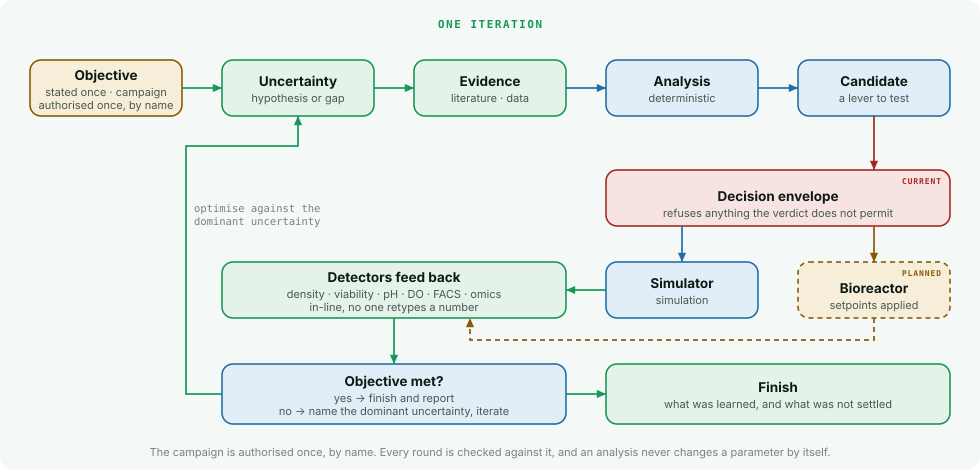
</picture>

An analysis never changes a parameter. It produces evidence; the orchestrator
decides, and the envelope can refuse.

---

## Quick start

**BioSense is a web application, and the hosted one runs the real agents.**
For most people there is nothing to install and no terminal to open.

### Just use it

> **Open the hosted app:** <!-- BIOSENSE_HOSTED_URL -->`https://biosense-production-e48f.up.railway.app`
>
> Pick a project, state your objective, press **Run AI discovery**. The badge on
> screen says **REAL AI — ONLINE**, and the discovery agents do the work:
> real literature search, real analyses over the data you selected, a real
> quantified hypothesis, one recommended protocol.

**Zero terminal commands.** You do not install Omnigent, start a server,
register an agent, or keep anybody's laptop switched on. The service runs the
Omnigent runtime and the agent bundle inside itself.

> **Which image is behind that link matters, and the page says so.** A service
> deployed from `deploy/Dockerfile.ai` with a model key offers
> **REAL AI — ONLINE**. One deployed from `deploy/Dockerfile` — the original,
> credential-free image — offers **SYNTHETIC DEMO** only, and shows the real
> option greyed with the reason. The badge on screen is always the truth about
> which one you are using. Switching an existing service over is a Dockerfile
> path, a volume mount at `/app/runs` and one secret:
> [deploy/README.md](deploy/README.md).

**What it costs you: nothing. What it costs the service: model credits** — which
is why real runs on the public instance are capped, and the caps are shown in
the page before you press anything:

| Cap | Default on the hosted instance |
|---|---|
| Real AI runs per visitor per day | 3 |
| Real AI runs across the service per day | 40 |
| One run's wall clock | 30 minutes, then it is stopped |
| Between one visitor's runs | 60 seconds |

Reaching a cap **refuses the run and says when to come back**. It never hands
you a synthetic run wearing a real badge — that substitution does not exist
anywhere in this codebase.

Also in the page, with no cap at all: the **synthetic demonstration** path
(deterministic code over committed fixtures — every stage, every card, the
protocol, the simulator, the benchmarks), simulator mode, and the benchmarks.

If the hosted runtime is down, the page says **which part** is missing and that
the demonstration path still works. It never disappears and never pretends.

### Run it yourself, if you need one of these

| You want | Why the hosted app cannot give it to you |
|---|---|
| **Real AI with no caps, on your own key** | the hosted instance pays for its own runs, so it limits them |
| **Your own private data analysed** | a private dataset never leaves the machine that ingested it, by design |
| **To develop or evaluate the code** | — |

Two commands, and the second one is optional:

```bash
git clone https://github.com/AbhinavSoni20191995/Biosense.git
cd Biosense
./scripts/start_local_ai.sh          # real AI: installs, starts and verifies everything
./scripts/check_local_ai.sh          # "READY", or the one thing to fix
```

`start_local_ai.sh` installs the Omnigent extra into the project, starts a
loopback Omnigent server with the agent registered, registers your machine as an
executor, asks BioSense itself whether a session could run, and only then opens
the app on **<http://127.0.0.1:8000>**. If any step fails it stops with the
reason and the fix — it never starts BioSense in a state where the button
quietly produces a demonstration instead.

It needs model credentials in the shell you run it from
(`export ANTHROPIC_API_KEY=sk-...`, or `claude auth login` on a subscription).
Without them it still starts, and tells you that the key is the missing part.

For the synthetic path alone, nothing but uv is needed:

```bash
uv sync --locked
uv run --frozen python -m biosense.production.app --runs runs --static webapp
```

### Using it

1. **Pick or create a project** — it decides which parameters exist, what their
   bounds are, and whether anything can predict them.
2. **State your objective** in your own words.
3. Optionally add **research context, your datasets, the values you want tested,
   and your process constraints**.
4. **Choose a runtime** — real AI, or the synthetic demonstration.
5. Press **Run AI discovery**.

You then watch it work, and read the evidence, the analyses, the quantified
hypothesis, the candidate parameters, the recommended protocol and the benchmark
— all in the page. **Reload the tab and the run comes back**: a run journals
itself beside its artifacts, so a refresh, a lost network or a redeploy does not
lose one. A run that was stopped mid-flight says so; it is never shown as
finished.

<picture>
  <source media="(prefers-color-scheme: dark)" srcset="docs/assets/progress-dark.png">
  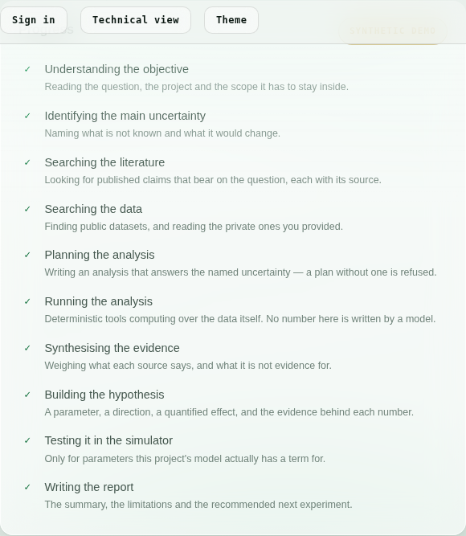
</picture>

<picture>
  <source media="(prefers-color-scheme: dark)" srcset="docs/assets/console-dark.png">
  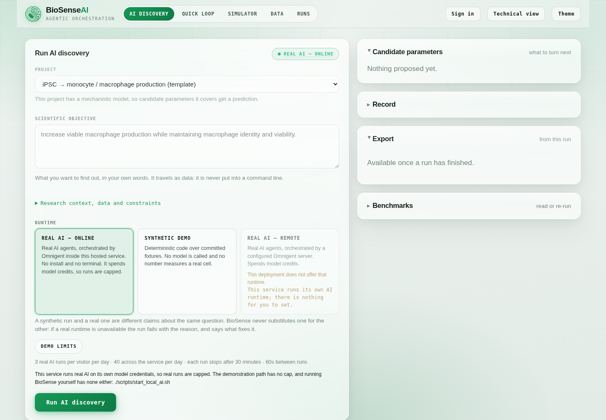
</picture>

### Hosting your own

<picture>
  <source media="(prefers-color-scheme: dark)" srcset="docs/assets/arch-deployment-dark.svg">
  
</picture>

One Railway service, one Dockerfile, one secret:

```bash
# deploy/Dockerfile.ai — BioSense + Omnigent server + executor, one container
ANTHROPIC_API_KEY=sk-...             # the only secret
# mount the volume at /app/runs, not /data/runs
```

`GET /readyz` then answers, without exposing anything: is the runtime reachable,
is the agent registered, is there an executor, does it have model credentials.
Full instructions, the environment variables and the reasoning:
**[deploy/README.md](deploy/README.md)**.

Running it on your own machine, remote Omnigent servers, signing in, Windows →
**[docs/RUN_ON_YOUR_PC.md](docs/RUN_ON_YOUR_PC.md)**

What was built for the hosted service, what was verified by running it, and what
was explicitly **not** verified →
**[docs/PHASE3_DELIVERABLES.md](docs/PHASE3_DELIVERABLES.md)**

---

## Synthetic, or real

These are different claims about the same question, and BioSense never
substitutes one for the other. The runtime badge is on screen the whole time.

The badge reads **SYNTHETIC DEMO**, **REAL AI — ONLINE** (the hosted service
runs the runtime itself) or **REAL AI — LOCAL** (your own machine). The middle
one is the same runtime as the last: *local* in a browser would mean *your
computer*, which it is not.

| | **SYNTHETIC DEMO** | **REAL AI** |
|---|---|---|
| Who does the work | deterministic code over committed fixtures | the discovery agents, through Omnigent |
| Literature search | a committed fixture index | real, against Europe PMC |
| Data analysis | real statistics over fixture tables | real statistics over **your** datasets |
| Needs credentials | no | yes — a model provider, via Omnigent |
| Costs money | no | yes |
| The bioreactor | a synthetic stand-in | **still a synthetic stand-in** |

That last row is the one to read twice. With real AI, the *evidence*, the
*analysis* and the *hypothesis* are real work over real data. The **reactor** is
not: BioSense touches no actuator, and a prediction for a new project comes from
one of three things, each labelled wherever it appears — the single calibrated
stand-in model (`MODELLED`), a response the agents proposed from cited claims
(`DE NOVO`, uncalibrated), or one you declared from experience
(`EXPERT-DECLARED`, a design choice). Real measurements enter only when a person
runs the experiment and brings the results back.

How the simulator turns a setpoint into an output, term by term →
**[docs/BIOSIMULATOR_MODEL.md](docs/BIOSIMULATOR_MODEL.md)**

There is also a **Quick loop** tab: type a question in plain language and watch
the deterministic stand-in loop run it in about a second and a half, with the
agents announcing each step. It is the fastest way to see the shape of the thing
and it calls no model at all.

<picture>
  <source media="(prefers-color-scheme: dark)" srcset="docs/assets/agents-dark.png">
  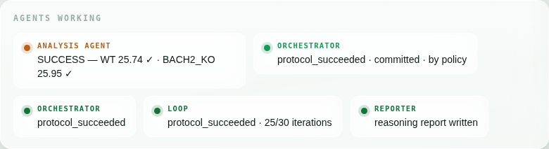
</picture>

---

## Make it your own process

BioSense has no universal control panel, and the Quick start's project is an
example, not the product.

**Every stirred-tank process shares the vessel** — impeller, dissolved oxygen,
feed schedule, seeding density, temperature, stage length. Those are offered to
every new project with the canonical registry's own bounds and meanings.

**Nothing else is shared.** You add the parameters your biology actually has,
and each arrives with a declared relationship to the simulator:

| | What it means |
|---|---|
| **Design variable only** | real, usable in the lab, and not predicted. The honest default. |
| **AI-proposed response** | the agents propose how it behaves from cited claims. It predicts, and every number says `DE NOVO · UNCALIBRATED`. |
| **You describe it** | you supply the shape and the constants. Private expert knowledge: it predicts, and any value resting on it is a design choice, never a cited one. |

`MODELLED` cannot be chosen from a form at all. That claim belongs to a fitted
model, and no dropdown can confer it.

Projects you create are stored in your workspace under the private data root —
never written into this repository, never served as files. Sign in through your
own Omnigent account and they belong to you; without a server configured there is
one local workspace, private because the machine is, and the interface says so in
those words rather than implying more.

---

## Benchmarks, in the app

A benchmark records whether BioSense did its job — identified an uncertainty,
planned an analysis, executed it deterministically, quantified what it could,
checked simulator coverage and labelled every number. **It does not measure
biological truth, and a run can pass every row while being biologically wrong.**

You can read the built ones and re-run a published configuration from the
browser, under either runtime, without cloning anything. A benchmark built from a
finished run is assembled from the artifacts that run already produced — the
biology is not run again — and one whose lineage touches private data is marked
**PRIVATE — DO NOT PUBLISH** and refused a public export rather than anonymised.

The benchmark CLI stays exactly as it is, for CI and automation.

---

## A worked result

Two questions, one run each:

1. *Optimise wild-type T cells grown from iPSC.*
2. *Now do it with a **BACH2 knockout** that must reach the same target.*

<picture>
  <source media="(prefers-color-scheme: dark)" srcset="docs/assets/trajectory-dark.png">
  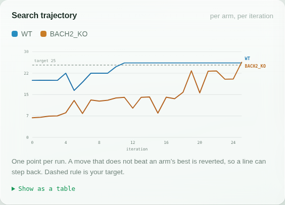
</picture>

| | Arms | Iterations used | Outcome |
|---|---|---|---|
| Wild type alone | WT | **3** of 30 | 25.7 — target met |
| With the knockout | WT + BACH2 KO | **25** of 30 | 25.7 and 26.0 — both met |

The number to look at is **3 against 25**. Adding one knocked-out arm multiplied
the search eightfold, and the loop says why in its own words:

> IL-7 cannot be set to one shared value: moving it 16 → 25.6 ng/mL improved
> BACH2_KO and degraded WT. The arms are being given separate values of this
> parameter from here on.

That is the finding: **no single shared recipe could serve both genotypes.** The
search established it from measurements rather than assuming it, then split the
parameter per arm. The knockout ended up needing more IL-7 at every stage and a
weaker TCR stimulus.

Reports, committed and readable without running anything →
**[`reports/`](reports/)** · the full write-up, including everything this does
*not* show → **[docs/IPSC_TCELL_EXAMPLE.md](docs/IPSC_TCELL_EXAMPLE.md)**

---

## It reasons across evidence, not just papers

BioSense weighs published literature, public datasets, a person's own
unpublished data, simulation and real measurements — and keeps them apart.

<picture>
  <source media="(prefers-color-scheme: dark)" srcset="docs/assets/arch-evidence-dark.svg">
  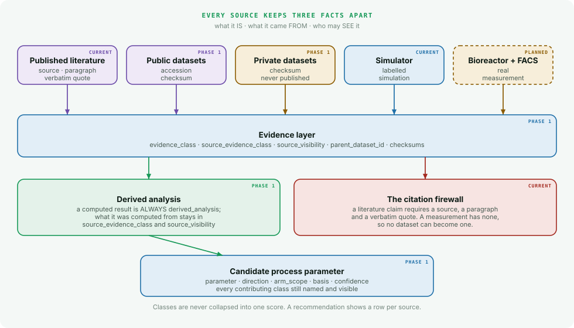
</picture>

Three facts stay separate, because collapsing them is how provenance gets lost.
An analysis of somebody's own FACS run is:

```
evidence_class        : derived_analysis      ← what it IS
source_evidence_class : private_user_dataset  ← what it came FROM
source_visibility     : private               ← who may SEE it
```

<picture>
  <source media="(prefers-color-scheme: dark)" srcset="docs/assets/analysis-card-dark.png">
  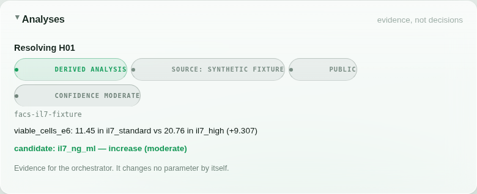
</picture>

**No analysis may run without naming the uncertainty it would reduce.** Not as a
convention — `AnalysisPlan` requires `uncertainty_ref`, and a plan citing a
hypothesis the loop never raised is refused by name. That is the difference
between a bioinformatics capability and a dashboard.

What runs today, and what is only declared:

<picture>
  <source media="(prefers-color-scheme: dark)" srcset="docs/assets/arch-capabilities-dark.svg">
  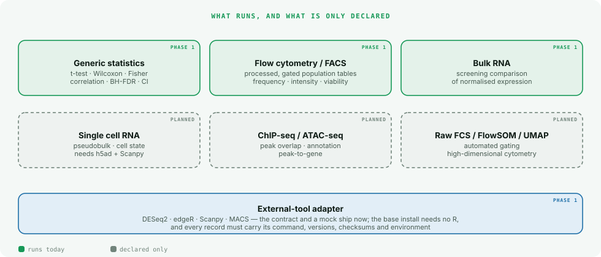
</picture>

The **Data** page answers the three questions people ask before starting: what
data is here, what analysis can run, and which processes BioSense knows how to
tune. The four capability states read differently on purpose — *runs here*,
*needs an install*, *needs a program*, *not written yet* — because only the last
has no remedy.

<picture>
  <source media="(prefers-color-scheme: dark)" srcset="docs/assets/data-panel-dark.png">
  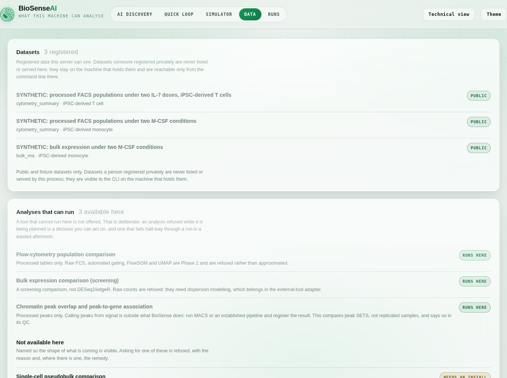
</picture>

Each process exposes only its own knobs, with its own limits and the origin of
any bound narrower than the global one. A parameter the model has no term for is
marked **not modelled** rather than hidden: it is a real design variable you can
set in the lab, and what it lacks is a prediction.

### Every number knows how it was produced

The most dangerous thing a system like this could do is let a simulated figure
and a measured one sit side by side looking alike. So the estimate type travels
with each number rather than with the card, report or hypothesis holding it, and
a comparison takes the weaker of its two inputs.

The hypothesis card is where that shows up: the badge sits beside each number,
because one card holds a measured baseline and a simulated candidate at once and
a single badge over both would be a claim about neither.

<picture>
  <source media="(prefers-color-scheme: dark)" srcset="docs/assets/hypothesis-card-dark.png">
  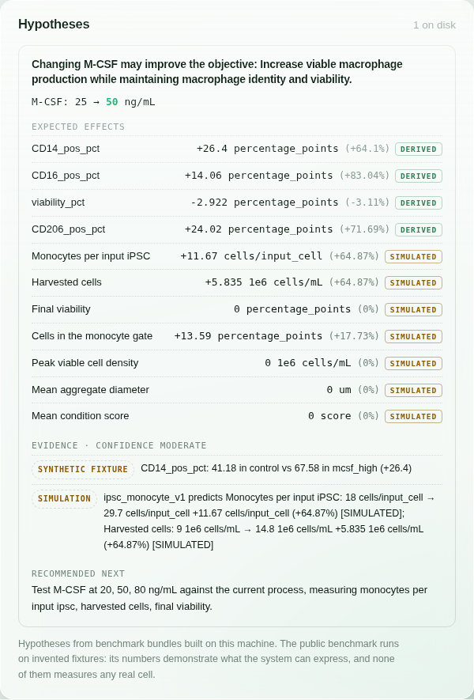
</picture>

<picture>
  <source media="(prefers-color-scheme: dark)" srcset="docs/assets/arch-provenance-dark.svg">
  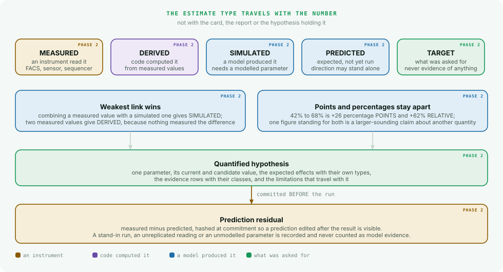
</picture>

A change computed from two measured values is **derived**, not measured: no
instrument measured a difference, code subtracted two readings, and a reader who
sees MEASURED beside "+26 percentage points" would believe something stronger
than is true. 42% to 68% is *+26 percentage points* **and** *+62% relative*,
reported as two figures, because one standing for both is a larger-sounding
claim about a different quantity. A prediction whose magnitude is not yet
estimated is a state the contract can express, with a required reason, rather
than a blank somebody fills in later.

The loop closes at the residual. A prediction is hashed when it is committed, and
a commitment timestamped after the run is refused — otherwise the comparison is a
model fitted to a result and then congratulated for matching it. Agreement is
reported; the model is never called validated.

Your own data stays yours: it lives outside every served directory, is
git-ignored, is never listed by the web app, and **can never become a literature
citation** — a claim needs a source, a paragraph and a verbatim quote, and a
measurement has none of those. It can support a hypothesis, contradict public
evidence and suggest a parameter. It cannot be cited.

Full detail → **[docs/BIOINFORMATICS.md](docs/BIOINFORMATICS.md)**

---

<!-- BENCHMARK:START -->

## A worked demonstration

> **SYNTHETIC DEMONSTRATION.** Every input is an invented fixture committed to this
> repository and the simulator is a mechanistic stand-in. No number below is a
> measurement of any real cell.

**Is M-CSF limiting monocyte output?** — project `ipsc_macrophage` v1.0.0, run offline with no model API and no network.

```bash
uv run --frozen python -m biosense.benchmark.cli run \
  --config benchmarks/configs/macrophage_mcsf_demo.json
```

<picture>
  <source media="(prefers-color-scheme: dark)" srcset="benchmarks/public/macrophage_mcsf_demo/figures/workflow-dark.svg">
  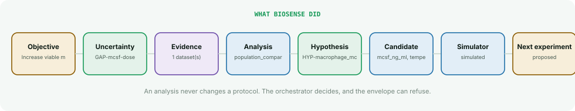
</picture>

BioSense started from the objective *"Increase viable macrophage production while maintaining macrophage identity and viability."*, identified the unresolved question `GAP-mcsf-dose`, and planned an analysis against it.

It ran `cytometry.population_comparison` v1.0.0 over `facs-mcsf-fixture`:

- CD14_pos_pct: 41.18 in control vs 67.58 in mcsf_high (+26.4) — *Welch's t-test, p=0.00132, BH-q=0.00176, n=3 vs 3, 95% CI [21.5, 31.5]*
- CD206_pos_pct: 33.5 in control vs 57.52 in mcsf_high (+24.02) — *Welch's t-test, p=0.000335, BH-q=0.000671, n=3 vs 3, 95% CI [21.4, 26.7]*

### The hypothesis it formed

Changing M-CSF may improve the objective: Increase viable macrophage production while maintaining macrophage identity and viability.

| Outcome | Baseline → Candidate | Change | Provenance |
|---|---|---|---|
| CD14 pos pct | 41.18% → 67.58% | +26.4 pp (+64.1%) | DERIVED |
| CD16 pos pct | 16.93% → 31% | +14.06 pp (+83.04%) | DERIVED |
| viability pct | 93.96% → 91.04% | -2.922 pp (-3.11%) | DERIVED |
| CD206 pos pct | 33.5% → 57.52% | +24.02 pp (+71.69%) | DERIVED |
| Monocytes per input iPSC | 17.99 cells/input_cell → 29.66 cells/input_cell | +11.67 cells/input_cell (+64.87%) | SIMULATED |
| Harvested cells | 8.995 1e6 cells/mL → 14.83 1e6 cells/mL | +5.835 1e6 cells/mL (+64.87%) | SIMULATED |
| Final viability | 80.78% → 80.78% | +0 pp (+0%) | SIMULATED |
| Cells in the monocyte gate | 76.66% → 90.25% | +13.59 pp (+17.73%) | SIMULATED |
| Peak viable cell density | 4.762 1e6 cells/mL → 4.762 1e6 cells/mL | +0 1e6 cells/mL (+0%) | SIMULATED |
| Mean aggregate diameter | 273.9 um → 273.9 um | +0 um (+0%) | SIMULATED |
| Mean condition score | 92.7 score → 92.7 score | +0 score (+0%) | SIMULATED |

**Confidence: moderate.** supported by 2 source(s) across 2 evidence class(es) capped below high: no real experimental measurement of this process supports it yet

### Simulator coverage

Every candidate parameter is accounted for. A parameter the model cannot predict is labelled, never dropped and never predicted anyway.

<picture>
  <source media="(prefers-color-scheme: dark)" srcset="benchmarks/public/macrophage_mcsf_demo/figures/parameter_change-dark.svg">
  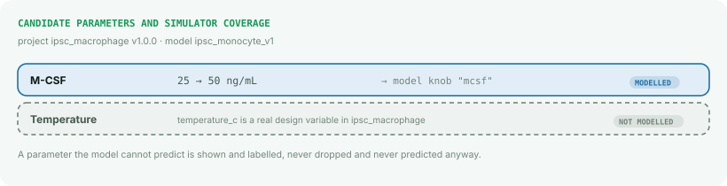
</picture>

<picture>
  <source media="(prefers-color-scheme: dark)" srcset="benchmarks/public/macrophage_mcsf_demo/figures/simulator_comparison-dark.svg">
  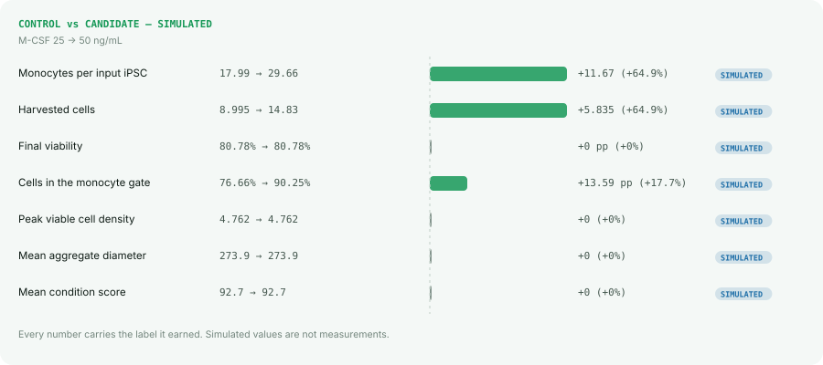
</picture>

**Next experiment.** Test M-CSF at 20, 50, 80 ng/mL against the current process, measuring monocytes per input ipsc, harvested cells, final viability.

**Capability scorecard: 17 PASS / 0 FAIL.** This is a SYSTEM CAPABILITY scorecard. It records whether BioSense identified an uncertainty, planned an analysis, executed it deterministically, quantified what it could, checked simulator coverage and labelled every number. It does NOT measure biological truth, and a run can pass every row while being biologically wrong.

Full bundle — report, figures, tables, provenance and the audit package → [`benchmarks/public/macrophage_mcsf_demo/`](benchmarks/public/macrophage_mcsf_demo/) · how benchmarks work → [docs/BENCHMARKING.md](docs/BENCHMARKING.md)

<!-- BENCHMARK:END -->

---

## One protocol at the end, and the ideas that did not survive

A run forms several hypotheses and some of them are wrong. Reading eight cards
and working out which survived is not the deliverable; one protocol is.

<picture>
  <source media="(prefers-color-scheme: dark)" srcset="docs/assets/protocol-card-dark.png">
  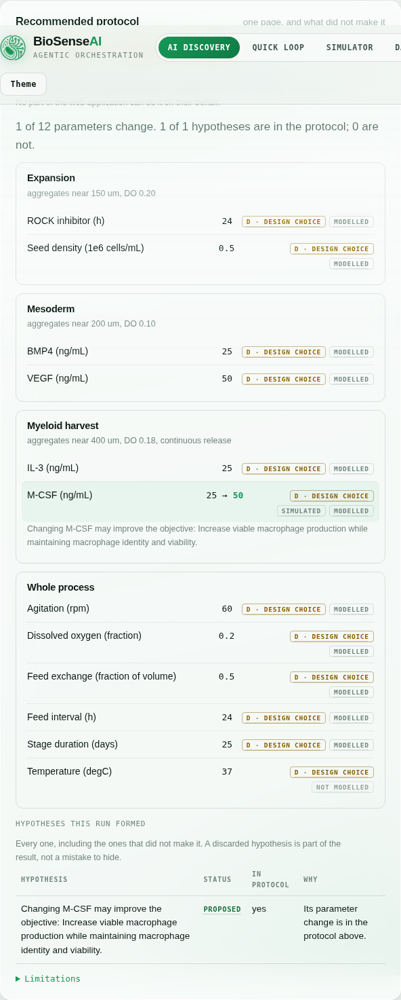
</picture>

It is stamped **PROPOSED — NOT APPROVED** and names the act that would approve
it: `approve-protocol --approved-by "<a person>"`, which is a command-line act
with a human behind it. No part of the web application can do it on their behalf.

Every value carries how firm it is — **R** reported, **A** adapted from cited
claims, **D** a design choice, **GAP** no evidence at all. A gap is never filled
with a plausible number; it is listed, and it blocks the wet lab.

And the hypotheses that did not make it stay on the page with the reason.
Showing only the winner would hide that three alternatives were considered and
ruled out, which is the part a reviewer most needs.

---

## Or turn the knobs yourself

The console asks the loop to find a condition. **Simulator mode** hands you the
same reactor — ten setpoints, a vessel you can watch day by day, and the
instrument readings each condition produces.

<picture>
  <source media="(prefers-color-scheme: dark)" srcset="docs/assets/simulator-dark.png">
  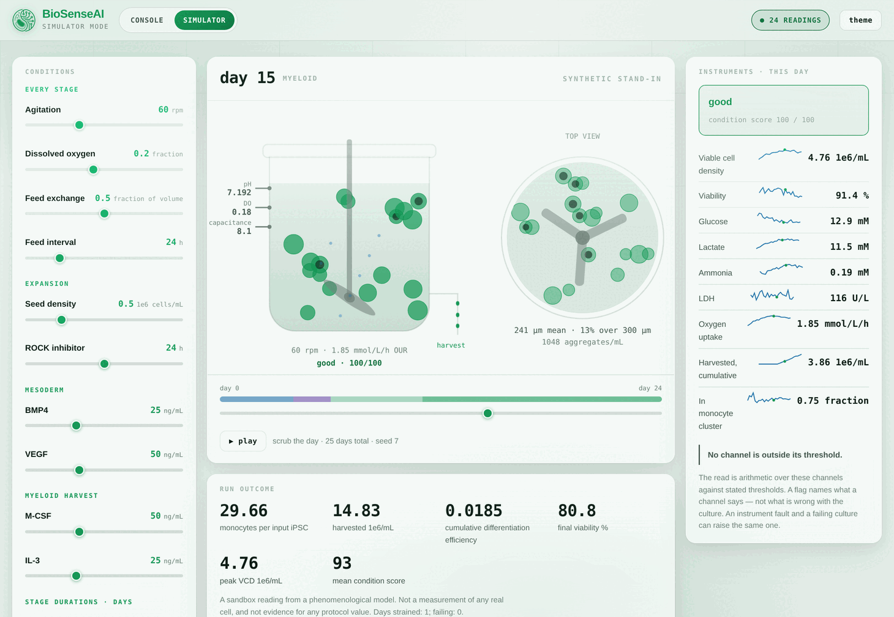
</picture>

Nothing in the drawing is decorative: circle size is the measured aggregate
diameter, a dark core means that fraction of aggregates is past the diameter
where the centre goes hypoxic, the specks are released LDH. Each day is scored
`good` / `strained` / `failing` by arithmetic over stated thresholds, and the
thresholds ship with the page.

Pick a probe fault from the *Starting culture* menu and the same exercise the
analysis agent faces appears: one channel says the culture is thinning, three
others disagree, and nothing about the biology has changed.

Hold two conditions, compare them, and carry one into a loop run — where every
quantity arrives as a **`design_choice`**, the provenance class that blocks the
wet lab until a named reviewer accepts it. A sandbox cannot launder a number
into a protocol.

Choosing a process this model is not for does **not** render borrowed sliders.
It lists that project's own knobs read-only and says why there is no trajectory:
an M-CSF control on a CAR-T process would invite a setpoint nobody can run, and
a prediction for it would be invented outright.

<picture>
  <source media="(prefers-color-scheme: dark)" srcset="docs/assets/simulator-no-model-dark.png">
  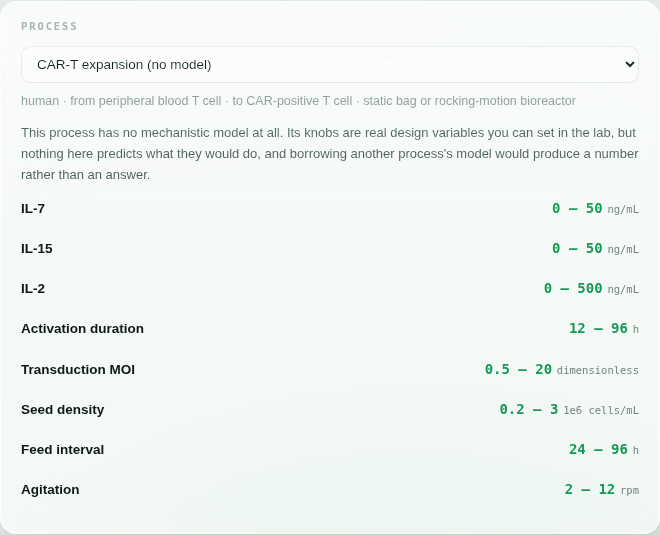
</picture>

Details, including what it does **not** model →
**[docs/SIMULATOR_MODE.md](docs/SIMULATOR_MODE.md)**

---

## Every run explains itself

The console shows the answer. The exported report carries the justification:

- **every decision** — its reasoning, the alternatives the envelope refused and
  *why each was refused*, the hypotheses raised and the basis for each;
- **every search move** — what it changed, for which arm, what happened, and
  whether it survived or was reverted;
- **every quantity** in the protocol with its provenance, so the line between a
  cited value and a chosen one is visible at a glance;
- **references** with DOIs, what each was used for, and whether its full text was
  ever actually retrieved.

A decision made by deterministic code is labelled as such. The report never
presents a rule as a model's reasoning.

---

## What this is **not**

An evaluator should know the limits before the features.

- **The bioreactor is a synthetic stand-in.** It is a phenomenological model, not
  a digital twin. No number this produces is a measurement of any real cell.
- **The stand-in was built to reward the levers the annotations suggest.** That
  is what makes the demonstration legible, and exactly what makes it worthless as
  biology. A real experiment could reward the opposite.
- **No protocol value is attributed to a publication.** The citations support the
  *direction* of a lever; every number is a design choice. The reports show that
  count rather than hiding it.
- **The cited BACH2 work is in peripheral and engineered T cells**, not
  iPSC-derived ones. The knowledge set separates what a paper reports
  (`local_annotation`) from a transfer to this cell type (`inference`).
- **One replicate per arm.** Every between-arm difference is directional only.
- **A loop that reaches a target has not produced a validated process.**
  Confirmation runs, replicate design and human QA sign-off are all outside it.
- **The reactor stays a stand-in even with real AI on.** Real AI makes the
  evidence, the analysis and the hypothesis real work over real data. It does not
  make the bioreactor real: nothing here actuates anything, and a prediction for
  a new process comes from the one calibrated stand-in model, a response the
  agents proposed, or one you declared — each labelled, none of them a
  measurement.
- **A proposed response is not a fitted one.** A `DE NOVO` or `EXPERT-DECLARED`
  term predicts because deterministic code evaluates a shape somebody chose with
  constants somebody supplied. Nothing was fitted to data, the effect it may have
  is bounded in the contract and clamped again in code, and every number it
  touches carries the calibrated value it started from.
- **Live model-driven orchestration has not been run end to end yet.** The
  deterministic path is fully exercised and the Omnigent adapter is verified
  against a real local server — agent resolution, session creation, the SSE
  stream and the no-runner refusal — but a complete live discovery session with
  model credentials remains a genuine test.
- **The dataset fixtures are invented.** Every committed example table is
  synthetic and every fixture accession begins with `SYNTHETIC-GSE`. BioSense has
  not downloaded or analysed a real public dataset.
- **Live repository search is written but unverified from this repository.**
  Outbound access to NCBI is blocked in the environment it was developed in, so
  the live branch has never run against the real service.
- **Single cell, ChIP-seq, ATAC-seq and raw FCS are declared, not implemented.**
  The contracts accept them so a manifest written today stays valid; calling one
  is refused with a message saying why.
- **Only one project has a mechanistic model.** `ipsc_macrophage` has
  `ipsc_monocyte_v1`; `cart_expansion` has none, and every parameter there
  reports `no_simulator` rather than borrowing one. A candidate parameter the
  model cannot predict is labelled `not_modelled`, never dropped and never
  predicted anyway.
- **Sign-in is Omnigent's, and a local instance has none.** Signing in through
  an Omnigent account gives you a workspace that is yours, because that server
  checked a password. Without one there is a single local workspace, private
  because the machine is private and not because anything verified it — which is
  what the interface says, rather than implying more.
- **A closed loop is authorised, not unattended.** A campaign authorisation is
  one named person covering a bounded number of iterations inside a stated
  envelope, checked every round. Past the count or outside the bounds the loop
  stops and asks again, and it cannot authorise itself.
- **A capability scorecard is not a measure of biological truth.** A benchmark
  can pass every row while being biologically wrong, and the artifact says so.

---

## Safety properties, enforced in code

Not conventions — things the software refuses to do:

| Rule | Where |
|---|---|
| A wet-lab run always needs a **named human approver**, whatever the autonomy mode says | `production/autonomy.py` |
| The web app refuses any request that is not a synthetic stand-in | `production/engine.py` |
| Agents never read the stand-in's hidden answers; no server ever serves a file named `truth` | `production/serve.py`, `report.py` |
| A gap in a protocol blocks the wet lab | `production/protocol.py` |
| Targets and QC limits can never be changed after results are seen | `production/orchestrator.py` |
| An unannotated gene returns `found: false` with the public queries to run — never a guessed effect | `bioinformatics/tools.py` |
| An analysis that names no uncertainty cannot be planned | `bioinformatics/plan.py` |
| A missing experimental-design field refuses the analysis and names the field | `data/manifest.py` |
| Private data is identified by **where it is**, not what it is called, and no server may be rooted inside it | `data/roots.py` |
| A dataset can never become a literature citation | the claim schema needs a source, paragraph and quote |
| An external-tool result with no software version is refused | `bioinformatics/external.py` |
| A parameter name that is not canonical is refused, never fuzzy-matched | `parameters.py` |
| A project cannot widen a canonical bound, and a narrowed one names its origin | `projects.py` |
| A simulated effect on a parameter the model does not cover is refused | `evidence/hypothesis.py` |
| Plain-language prose is rejected if a number in it is in no structured fact | `evidence/narrative.py` |
| Expert knowledge can never become a citation or set a protocol value | `evidence/expert.py` |
| A public benchmark export refuses when private lineage exists, rather than anonymising | `benchmark/privacy.py` |

```bash
uv run --frozen python -m unittest     # 848 tests
bash scripts/check.sh                  # + offline loop smoke tests + agent-spec validation
```

---

## Where things are

| Path | What it holds |
|---|---|
| [`webapp/console.html`](webapp/console.html) | the console you see above |
| [`webapp/simulator.html`](webapp/simulator.html) | simulator mode: the knobs, the vessel, the timeline |
| [`biosense/production/`](biosense/production/) | the loop: designer, optimiser, analysis, envelope, reports |
| [`standins/`](standins/) | synthetic stand-in reactors |
| [`discovery_loop/`](discovery_loop/) | the Omnigent agent bundle for the live, model-driven path |
| [`biosense/production/runtime.py`](biosense/production/runtime.py) | which runtime answers, and why one cannot |
| [`biosense/production/health.py`](biosense/production/health.py) | `/readyz`: the four-part readiness truth, with no secrets |
| [`biosense/production/budget.py`](biosense/production/budget.py) | what a visitor may spend on real AI |
| [`biosense/production/run_store.py`](biosense/production/run_store.py) | a run's own record, so a reload is not a loss |
| [`scripts/start_local_ai.sh`](scripts/start_local_ai.sh) | one command to real AI on your machine |
| [`deploy/Dockerfile.ai`](deploy/Dockerfile.ai) | the hosted image: app + Omnigent server + executor |
| [`biosense/parameters.py`](biosense/parameters.py) | the canonical identity of every process parameter |
| [`projects/`](projects/) | project profiles: which knobs a biological system actually has |
| [`biosense/evidence/`](biosense/evidence/) | quantified estimates, hypotheses, context, expert knowledge, narrative |
| [`biosense/benchmark/`](biosense/benchmark/) | the benchmark runner, figures, report and privacy validator |
| [`benchmarks/`](benchmarks/) | benchmark configurations and the committed public demonstration |
| [`biosense/data/`](biosense/data/) | dataset manifests, the registry, ingest and the source adapters |
| [`biosense/bioinformatics/`](biosense/bioinformatics/) | annotation, analysis planning, the tool registry and execution |
| [`bioinfo_knowledge/`](bioinfo_knowledge/) | gene annotations, each with its own confidence and citation |
| [`examples/datasets/`](examples/datasets/) | synthetic dataset fixtures, all labelled as invented |
| `private_data/` | where your own data lands. Git-ignored, never served |
| [`reports/`](reports/) | the committed example reports, HTML and PDF |
| [`docs/`](docs/) | setup, the worked example, the production loop in depth |

**Deeper reading:** [the production loop](docs/PRODUCTION_LOOP.md) ·
[simulator mode](docs/SIMULATOR_MODE.md) ·
[bioinformatics, data and evidence](docs/BIOINFORMATICS.md) ·
[benchmarks and demonstrations](docs/BENCHMARKING.md) ·
[the worked example](docs/IPSC_TCELL_EXAMPLE.md) ·
[running it yourself](docs/RUN_ON_YOUR_PC.md) ·
[the literature agent](docs/LITERATURE_AGENT.md) ·
[bioinformatics knowledge sets](bioinfo_knowledge/README.md) ·
[max-mode instruments](analysis_agent/README.md) ·
[hosting](deploy/README.md) · [Omnigent setup](OMNIGENT_SETUP.md)

---

<div align="center">
<sub>Not clinical or manufacturing guidance. MIT licensed.</sub>
</div>
